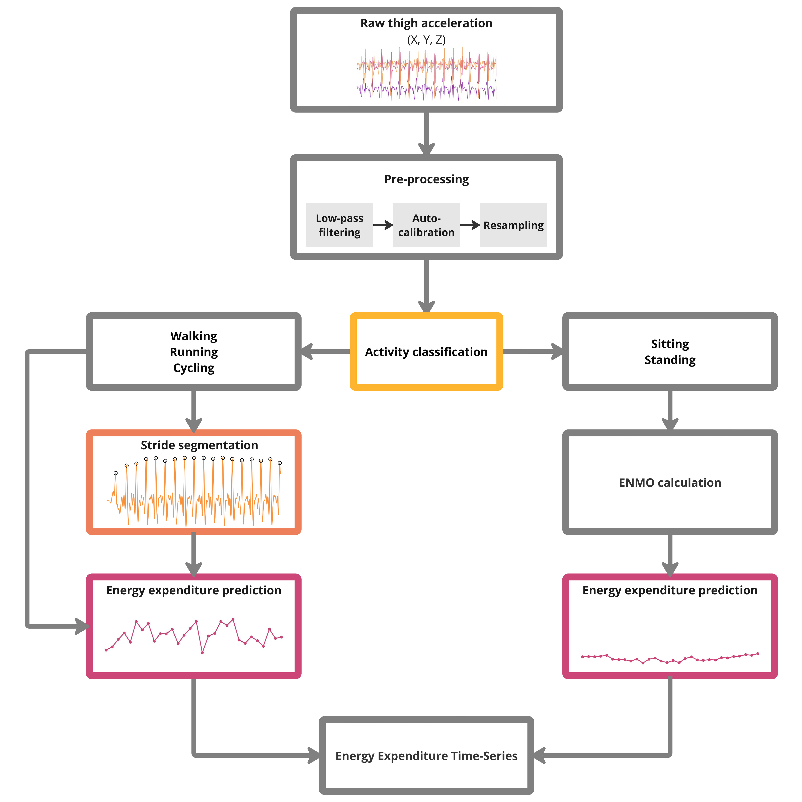

# Composite activity type and stride-specific energy expenditure estimation (CATSE³)
CATSE³ represents an explorative approach to estimate energy expenditure based on raw data from a single thigh-worn accelerometer. CATSE³ combines an activity classification model with a subsequent stride-specific energy estimation approach for walking, running and cycling. The overall approach was inspired by earlier research, especially by Patrick Slade et al. [[Paper](https://doi.org/10.1038/s41467-021-24173-x)] and Mael Garnotel and Thomas Bastian [[Paper](https://doi.org/10.1152%2Fjapplphysiol.00556.2017)].

## 🚵🏽‍♀️ Free-living validation
We are currently looking for datasets comprising multi-day thigh-worn accelerometer data (50Hz+) and overall energy expenditure assessed using doubly labeled water as the reference. Please do get in touch, if you have access to such data.

## 📄 Paper
Lendt, C., Hansen, N., Froböse, I. et al. Composite activity type and stride-specific energy expenditure estimation model for thigh-worn accelerometry. *Int J Behav Nutr Phys Act* 21, 99 (2024). https://doi.org/10.1186/s12966-024-01646-y

## 🔓 Open dataset
Most of the underlying data is openly accessible as part of the papers Zenodo repository: https://doi.org/10.5281/zenodo.13477128.

## 💸 Funding
CATSE³ is based upon the results of the research project 'Estimation of activity induced energy expenditure using thigh-worn accelerometry and machine learning approaches'. This project was funded by the Internal Research Funds of the German Sport  University Cologne, grant agreement number L-11-10011-267-121010. Claas Lendt was further supported by a fellowship of the German Academic Exchange  Service (DAAD).
